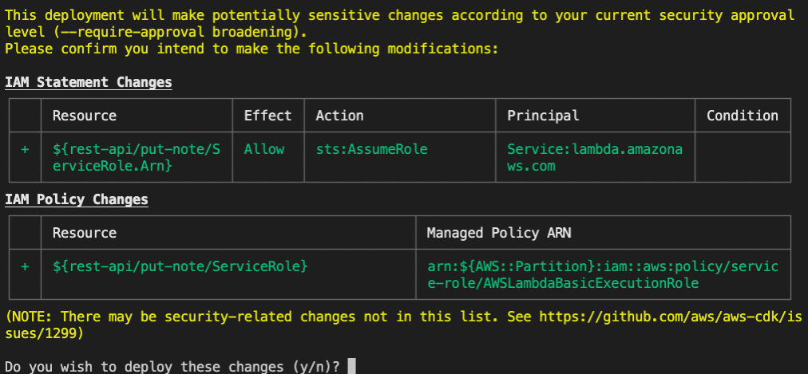

# REST API

## In this lab …

- Setting up AWS CDK
- Setting up REST API with Amazon API Gateway, Lambda, and DynamoDB

## Bootstrapping

### 📝 Task

Create a fresh AWS CDK app with Projen.

### 🔎 Hints

- [Getting started with Projen](https://github.com/projen/projen#getting-started)

### 🗺  Step-by-Step Guide

1. Create a new folder `notes-api`:
   ```bash
   mkdir notes-api
   ```
1. Step into the folder:
   ```bash
   cd notes-api
   ```
1. Init AWS CDK with Projen:
   ```bash
   npx projen@latest new awscdk-app-ts --package-manager 'NPM' --github false --no-git
   ```
1. Go to the file `./src/main.ts`. Scroll down and find this line:
  ```ts
  new MyStack(app, 'my-stack-dev', { env: devEnv });
  ```
  Rename `my-stack-dev` to something unique (e.g. append your name).
1. Deploy the CloudFormation stack:
   ```bash
   npm run deploy
   ```

## AWS Lambda function

### 📝 Task

Now that we have an AWS CDK app, we want to deploy the first resource. Create a simple AWS Lambda function, that logs the message `Hello world :)`.

### 🔎 Hints

- [CDK Construct to create a Node.js Lambda function](https://docs.aws.amazon.com/cdk/api/latest/docs/aws-lambda-nodejs-readme.html#nodejs-function)
- [Simple Lambda function with log output](https://docs.aws.amazon.com/lambda/latest/dg/nodejs-logging.html)
- [Hint about local bundling (to avoid Docker)](https://docs.aws.amazon.com/cdk/api/latest/docs/aws-lambda-nodejs-readme.html#local-bundling)
- [Adding CDK dependencies with Projen](https://github.com/projen/projen/blob/main/API.md#class-awscdktypescriptapp--)

### 🗺  Step-by-Step Guide

1. Create a new file for the AWS Lambda function:
   ```bash
   touch ./src/rest-api.put-note.ts 
   ```
1. Add the following code to the file:
   ```typescript
   export const handler = async () => {
     console.log("Hello World :)");
   };
   ```
1. Update the `.projenrc.js` configuration:
   ```js
   const { awscdk, javascript } = require('projen');
   const project = new awscdk.AwsCdkTypeScriptApp({
     cdkVersion: '2.1.0',
     defaultReleaseBranch: 'main',
     name: 'lab1',
     github: false,
     packageManager: javascript.NodePackageManager.NPM,
     deps: [
       'aws-sdk',
     ],
     devDeps: [
       '@types/aws-lambda',
     ],
   });
   project.synth();
   ```
1. Run `npm run projen` to install the new dependencies and re-generate the auto-generated files.
1. Create a new file for our first construct:
   ```bash
   touch ./src/rest-api.ts 
   ```
1. Add the following code to the file:
   ```typescript
   import { aws_lambda_nodejs as lambdaNodeJs } from 'aws-cdk-lib';
   import { Construct } from 'constructs';
   
   export class RestApi extends Construct {
     constructor(scope: Construct, id: string) {
       super(scope, id);
   
       new lambdaNodeJs.NodejsFunction(this, "put-note");
     }
   }
   ```
1. Update the file `./src/main.ts`:
   ```typescript
   import { App, Stack, StackProps } from 'aws-cdk-lib';
   import { Construct } from 'constructs';
   import { RestApi } from './rest-api';
   
   export class MyStack extends Stack {
     constructor(scope: Construct, id: string, props: StackProps = {}) {
       super(scope, id, props);
   
       new RestApi(this, 'rest-api');
     }
   }
   ```
   ⚠️Important: Only update the imports and the class. Everything below the class should be the same.
1. Deploy the latest changes: `npm run deploy`

   Be aware you will be asked to confirm IAM Statement and IAM Policy Changes:

   

### ❓ Questions

- What resources did you create and why?
- How can you execute the AWS Lambda function using the AWS Management Console?
- Where can you find the log output?

## Amazon API Gateway

### 📝 Task

The AWS Lambda function is already a big step, but now we want to create a HTTP endpoint so we can execute the AWS Lambda function. We use Amazon API Gateway to create a simple API.

The API should be able to handle this curl request:

```bash
$ > curl -X POST https://XXXXX.execute-api.eu-central-1.amazonaws.com/notes
HTTP/2 200

{"hello":"world"}
```

### 🔎 Hints

- [CDK Construct to create an API Gateway with Lambda integration](https://docs.aws.amazon.com/cdk/api/latest/docs/aws-apigatewayv2-readme.html#defining-http-apis)
- [Lambda function response format for API Gateway integrations](https://docs.aws.amazon.com/apigateway/latest/developerguide/http-api-develop-integrations-lambda.html#http-api-develop-integrations-lambda.response)
- [CloudFormation stack output for the API endpoint](https://docs.aws.amazon.com/cdk/api/latest/docs/core-readme.html#stack-outputs)

### 🗺  Step-by-Step Guide

1. Update the file `./src/rest-api.ts`:
   ```typescript
   import {
     aws_lambda_nodejs as lambdaNodeJs,
     aws_apigateway as apigateway,
   } from 'aws-cdk-lib';
   import { Construct } from 'constructs';
   
   export class RestApi extends Construct {   
     constructor(scope: Construct, id: string) {
       super(scope, id);
   
       const putNote = new lambdaNodeJs.NodejsFunction(this, 'put-note');
   
       const api = new apigateway.RestApi(this, 'api');
       const resource = api.root.addResource('notes');
   
       resource.addMethod('POST', new apigateway.LambdaIntegration(putNote));
     }
   }
   ```
1. Update the AWS Lambda function (`./src/rest-api.put-note.ts`):
   ```typescript
   export const handler = async () => {
     console.log('Hello World :)');

     return {
       statusCode: 200,
       body: JSON.stringify({ hello: 'world' }),
     };
   };
   ```
1. Deploy the latest changes:
   ```bash
   npm run deploy
   ```
1. Copy the endpoint URL from the output of the deployment in your terminal and run the following request to send a HTTP request:
   ```bash
   curl -X POST https://XXXXX.execute-api.eu-central-1.amazonaws.com/prod/notes
   ```

### ❓ Questions

- What is a stack's output and where do you find it?
- What is the response format for AWS Lambda functions when using them with Amazon API Gateway?
- What are the limits for an Amazon API Gateway HTTP API?

## AWS DynamoDB

### 📝 Task

We have an API in place, executing the AWS Lambda function to return a HTTP status code and some JSON. Great, now we want to create a DynamoDB table to persist some data.

The API should be able to handle this request:

```bash
$ > curl -X POST https://XXXXXXX.execute-api.eu-central-1.amazonaws.com/notes --data '{ "title": "Hello World", "content": "abc" }' -H 'Content-Type: application/json' -i
HTTP/2 201
```

The note should be persisted in the DynamoDB table.

### 🔎 Hints

- [CDK Construct to create a DynamoDB table](https://docs.aws.amazon.com/cdk/api/latest/docs/aws-dynamodb-readme.html)
- [Prop to pass the DynamoDB table name to the AWS Lambda function environment](https://docs.aws.amazon.com/cdk/api/latest/docs/@aws-cdk_aws-lambda-nodejs.NodejsFunction.html#environment)
- [Prop to grant access to the DynamoDB table, so the AWS Lambda function can send requests](https://docs.aws.amazon.com/cdk/api/latest/docs/@aws-cdk_aws-dynamodb.Table.html#grantgrantee-actions)
- [NPM package for AWS Lambda function event types (APIGatewayProxyEvent is your friend)](https://www.npmjs.com/package/@types/aws-lambda)
- [Documentation for the DynamoDB DocumentClient](https://docs.aws.amazon.com/AWSJavaScriptSDK/latest/AWS/DynamoDB/DocumentClient.html#put-property)
- [Hint about promises for the DocumentClient](https://docs.aws.amazon.com/sdk-for-javascript/v2/developer-guide/using-promises.html)

### 🗺  Step-by-Step Guide

1. Update the construct (`src/rest-api.ts`):
   ```typescript
   import {
     aws_dynamodb as dynamodb,
     aws_lambda_nodejs as lambdaNodeJs,
     aws_apigateway as apigateway,
   } from 'aws-cdk-lib';
   import { Construct } from 'constructs';
   
   export class RestApi extends Construct {
     public notesTable: dynamodb.Table;
   
     constructor(scope: Construct, id: string) {
       super(scope, id);
   
       this.notesTable = new dynamodb.Table(this, 'notes-table', {
         partitionKey: { name: 'id', type: dynamodb.AttributeType.STRING },
       });
   
       const putNote = new lambdaNodeJs.NodejsFunction(this, 'put-note', {
         environment: {
           TABLE_NAME: this.notesTable.tableName,
         },
       });
      
       this.notesTable.grant(putNote, 'dynamodb:PutItem');
   
       const api = new apigateway.RestApi(this, 'api');
       const resource = api.root.addResource('notes');
   
       resource.addMethod('POST', new apigateway.LambdaIntegration(putNote));
     }
   }
   ```
1. Update the AWS Lambda function (`src/rest-api.put-not.ts`):
   ```typescript
   import * as AWS from 'aws-sdk';

   export const handler = async (event: AWSLambda.APIGatewayProxyEvent) => {
     const DB = new AWS.DynamoDB.DocumentClient();

     const body = JSON.parse(event.body || '{}');

     if (!body.title || !body.content) {
       return {
         statusCode: 400,
       };
     }

     await DB.put({
       Item: {
         id: new Date().toISOString(),
         title: body.title,
         content: body.content,
       },
       TableName: process.env.TABLE_NAME!,
     }).promise();

     return {
       statusCode: 201,
     };
   };
   ```
1. Deploy the latest changes:
   ```bash
   npm run deploy
   ```
1. Send a HTTP request with your endpoint url:
   ```bash
   curl -X POST https://XXXXXX.execute-api.eu-central-1.amazonaws.com/prod/notes --data '{ "title": "Hello World", "content": "abc" }' -H 'Content-Type: application/json' -i
   ```
1. Ideally, we have stored the first DynamoDB item! 🎉

### ❓ Questions

- Where do you see the environment variables of the AWS Lambda function using the AWS Management Console?
- When deleting the CloudFormation stack by accident, would the DynamoDB table be removed or not?
- Why is the AWS Lambda function allowed to send requests to the DynamoDB table?
- Why is the partition key enough to create a DynamoDB table instead of a schema?
- What is the maximum size of a note's content?

## Fetch list of notes

### 📝 Task

The first endpoint works! Let's extend the API and provide another route to fetch all notes. The API should be able to handle this request:

```bash
$ > curl https://XXXXXX.execute-api.eu-central-1.amazonaws.com/notes -i
HTTP/2 200

[{"content":"abc","id":"2021-04-27T11:54:47.987Z","title":"Hello World"}]
```

### 🔎 Hints

- [DocumentClient Scan operation](https://docs.aws.amazon.com/AWSJavaScriptSDK/latest/AWS/DynamoDB/DocumentClient.html#scan-property)

### 🗺  Step-by-Step Guide

1. Extend the construct (`./src/rest-api.ts`):
   ```typescript
   import {
     aws_dynamodb as dynamodb,
     aws_lambda_nodejs as lambdaNodeJs,
     aws_apigateway as apigateway,
   } from 'aws-cdk-lib';
   import { Construct } from 'constructs';
   
   export class RestApi extends Construct {
     public notesTable: dynamodb.Table;
   
     constructor(scope: Construct, id: string) {
       super(scope, id);
   
       this.notesTable = new dynamodb.Table(this, 'notes-table', {
         partitionKey: { name: 'id', type: dynamodb.AttributeType.STRING },
       });
   
       const putNote = new lambdaNodeJs.NodejsFunction(this, 'put-note', {
         environment: {
           TABLE_NAME: this.notesTable.tableName,
         },
       });
   
       const listNotes = new lambdaNodeJs.NodejsFunction(this, 'list-notes', {
         environment: {
           TABLE_NAME: this.notesTable.tableName,
         },
       });
   
       this.notesTable.grant(putNote, 'dynamodb:PutItem');
       this.notesTable.grant(listNotes, 'dynamodb:Scan');
   
       const api = new apigateway.RestApi(this, 'api');
       const resource = api.root.addResource('notes');
   
       resource.addMethod('POST', new apigateway.LambdaIntegration(putNote));
       resource.addMethod('GET', new apigateway.LambdaIntegration(listNotes));
     }
   }
   ```
1. Create a new file for the second AWS Lambda function:
   ```bash
   touch src/rest-api.list-notes.ts
   ```
1. Add the following code to the file:
   ```typescript
   import * as AWS from 'aws-sdk';

   export const handler = async () => {
     const DB = new AWS.DynamoDB.DocumentClient();

     const response = await DB.scan({
       TableName: process.env.TABLE_NAME!,
     }).promise();

     return {
       statusCode: 200,
       body: JSON.stringify(response.Items),
     };
   };
   ```
1. Deploy the latest changes:
   ```bash
   npm run deploy
   ```
1. Run the following request with your endpoint URL:
   ```bash
   curl https://XXXXXX.execute-api.eu-central-1.amazonaws.com/prod/notes
   ```

### ❓ Questions

- How many notes are returned in the worst case?
- What is the difference between a DynamoDB Scan and Query operation?

---

You can find the complete implementation of this lab [here](https://github.com/superluminar-io/serverless-workshop/tree/main/packages/lab1).
